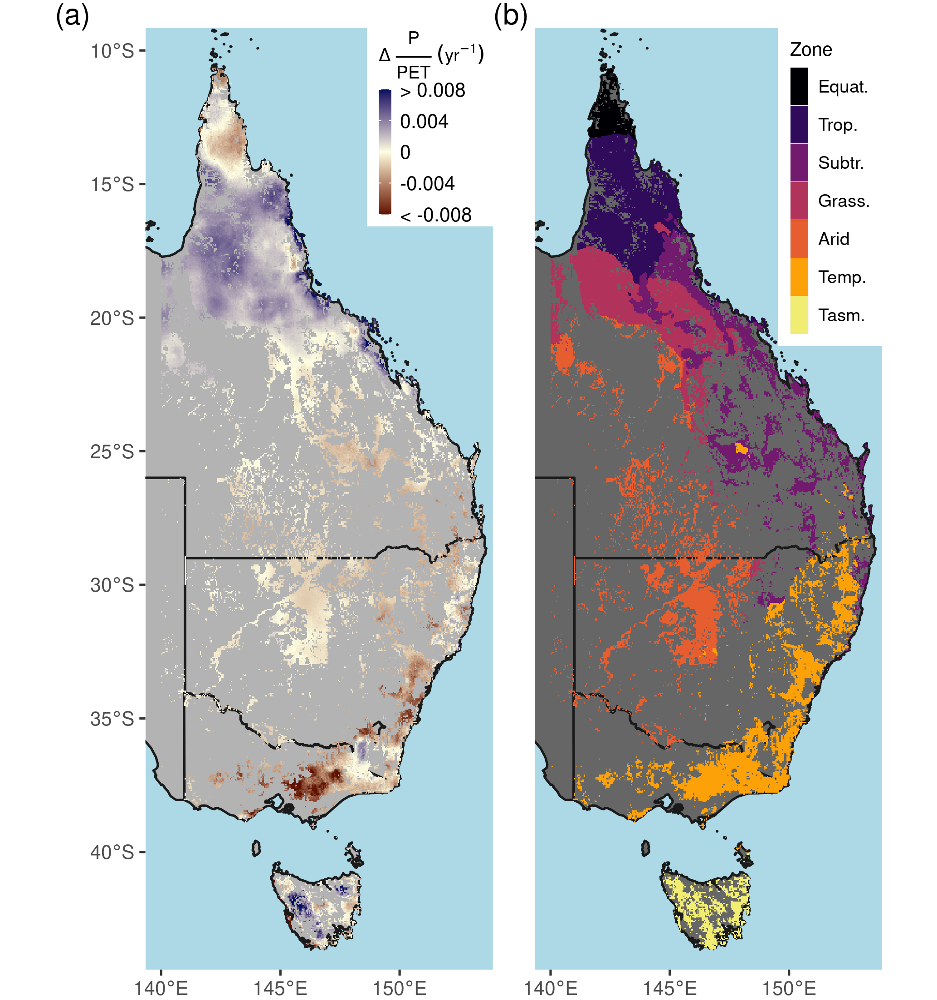

\introduction[Introduction]

Australia is the world's driest inhabited continent. Predicting how
climate change will affect ecosystem resilience and alter Australia's
terrestrial hydrological cycle is of paramount importance. Australia's
woody ecosystems are mostly concentrated in the east, where there are
large gradients of precipitation (P) (300 - 2000+ mm yr^-1^) and
potential evapotranspiration (PET) (800-2100 mm yr^-1^). Most eastern
Australian woodlands occupy water-limited regions where annual PET far
exceeds P (Fig. A1), and tree species have evolved to cope with
water-limited conditions [@petersLivingEdgeContinentalscale2021] and high interannual
rainfall variability. However, the climate is warming: eight of
Australia's ten warmest years on record have occurred since 2005 [@csiroStateClimate20202020] and Australia's climate has warmed by \~1.5℃ since records began in 1910. The warming has likely increased
atmospheric demand for water (e.g. PET or vapor pressure deficit, VPD).
In most woody ecosystems, the ratio of water supply (i.e. P) to water
demand (i.e. PET) has declined in recent decades (Figs. 1,2a). Eastern
Australia has also been impacted by several multi-year droughts,
episodic deluges of rainfall [@kingRoleClimateVariability2020b], and an increasing
frequency of severe heatwaves [@perkinsIncreasingFrequencyIntensity2012a] in the last few
decades. Precipitation changes have been spatially variable over eastern
Australia, where northern Queensland grew wetter and southeast Australia
grew drier (Fig. A2). In the last two decades, southeast Australia
experienced the two worst droughts in the observational record
(2001-2009; @vandijkMillenniumDroughtSoutheast2013d and 2017-2019; [@bureauofmeteorologyAnnualAustralianClimate].
Yet between these two droughts, Eastern Australia experienced record
breaking rainfall in 2011 associated with a strong La Niña event. This
caused marked vegetation 'greening' (e.g. increased foliar cover), even
in the arid interior [@bastosGlobalNPPDependence2013a; @poulterContributionSemiaridEcosystems2014; @ahlstromDominantRoleSemiarid2015a]. However, this greening contributed to
record-breaking fires in the following year [@harrisBiologicalResponsesPress2018b].

Theory suggests that plant physiological responses to atmospheric carbon
dioxide (CO~2~) may mitigate some of the negative effects of an aridifying
climate. However, the magnitude of plant responses to increased
atmospheric CO~2~ has been challenging to establish in field experiments
[@jiangFateCarbonMature2020b], from observations [@zhuGreeningEarthIts2016a; @walkerIntegratingEvidenceTerrestrial2020b], or to separate from other drivers (e.g. climate variability,
disturbances, and changes in land management). Studies have used data
from the Advanced Very High Resolution Radiometer (AVHRR) satellites to
show positive trends in the normalized difference vegetation index
(NDVI) over Australia [@donohueClimaterelatedTrendsAustralian2009c]. The greening trend is
caused by increased leaf area, which has resulted from increased
atmospheric CO~2~ concentrations [@donohueClimaterelatedTrendsAustralian2009c; @ukkolaReducedStreamflowWaterstressed2016b]. The evidence for increases in leaf area from rising CO~2~ have also been supported by observations of reduced runoff in Australia's drainage
basins [@trancosoCOVegetationFeedbacks2017b; @ukkolaReducedStreamflowWaterstressed2016b].

Yet disentangling the CO~2~ fertilization effect from other drivers of
climate variability and global change has been particularly challenging
for satellite based analyses. It is challenging to attribute causes of
greening because of co-occurring changes in climate, land-use, and
disturbance are confounded with the effect of CO~2~ fertilization.
Furthermore, the time series of even the longest systematically
collected optical vegetation index records from a single sensor is 20
years (e.g. MODIS Terra). Analysis of trends extending beyond 20 years
requires merging satellite records across sensors and platforms. But
this requires care to address changes in radiometric and spatial
resolution of the sensor, as well as drift in the solar zenith angle [@jiEffectNOAASatellite2017a; @frankenbergCOMMENTRECENTGLOBAL2021] and the time of retrieval. Thus different analytical methodologies have produced disagreements over
where greening has occurred [@cortesWhereAreGlobal2021]. One often-used method
to provide additional constraint on greening trends has been to compare
remote sensing derived trends with modeled changes in leaf area index
(LAI) from ensembles of dynamic global models [@zhuGreeningEarthIts2016a; @wangRecentGlobalDecline2020]. However these model attribution approaches rely on a set of
key assumptions. None of the models can accurately predict LAI changes
in response to rising CO~2~ [@dekauwe_etal14; @medlynUsingModelsGuide2016c].
Vegetation models have been shown to diverge in their simulation of LAI
over Australia [@medlynUsingModelsGuide2016c; @teckentrupAssessingRepresentationAustralian2021; @zhuGreeningEarthIts2016a], and have bioclimatic rules for determining phenology
which may not be appropriate for the highly variable Australian climate
and the evergreen Eucalyptus forests [@teckentrupAssessingRepresentationAustralian2021]. These
model simulations are typically compared with modeled LAI products
derived from the red and near infrared wavelengths of multispectral
satellite sensors, of which each product carries specific algorithmic
assumptions about canopy-light interception which are conditional upon
estimated land cover types. In comparison, NDVI carries no ecosystem
specific assumption, and is an effective proxy of leaf area in
ecosystems with low-to-moderate canopy cover [@carlsonRelationNDVIFractional1997a], a
characteristic of eastern Australian woody ecosystems [@spechtWaterUsePerennial1972; @yangApplyingConceptEcohydrological2018a].

Here we ask, how much can greening trends be explained by rising CO~2~?
Using eastern Australia as a model system, we used a multi satellite
derived NDVI record encompassing 38 years to isolate the influence of
CO~2~ from simultaneous effects of meteorological change and disturbance.
Next we contrasted CO~2~ effects with theoretical predictions based on
water-use-efficiency (WUE) theory for plants and the observed rise in
CO~2~. Finally, we examined whether recent NDVI greening trends have
co-occurred with changes in tree or grass cover over the last two
decades.

# Methods

## Study area

The study region encompasses the dominant woody ecosystems of eastern
Australia (Fig. A1b). We used the National Vegetation Information System
5.1 land cover dataset (@DepartmentAgricultureWater; Table A1) to select locations designated as
"Acacia Forests and Woodlands", "Acacia Open Woodlands", "Callitris
Forests and Woodlands", "Casuarina Forests and Woodlands", "Eucalypt Low
Open Forests", "Eucalypt Open Forests", "Eucalypt Open Woodlands",
"Eucalypt Tall Open Forests", "Eucalypt Woodlands", "Low Closed Forests
and Tall Closed Shrublands", "Mallee Open Woodlands and Sparse Mallee
Shrublands", "Mallee Woodlands and Shrublands", "Melaleuca Forests and
Woodlands", "Other Forests and Woodlands", "Other Open Woodlands",
"Rainforests and Vine Thickets", and "Tropical Eucalypt
Woodlands/Grasslands".


## Climate and remote sensing datasets

We used the atmospheric CO~2~ record from the deseasonalized Mauna Loa
record (<https://www.esrl.noaa.gov/gmd/ccgg/trends/data.html>), and
extracted climate data (Table A1) from the Australian Bureau of
Meteorology's Australian Water Availability Project (AWAP; @jonesHighqualitySpatialClimate2009). AWAP is a gridded climate product interpolated to 0.05° from a
large network of meteorological stations distributed across Australia.
Vapor pressure deficit was calculated using daily estimates of maximum
temperature and vapor pressure at 15:00 hours. PET was calculated from
shortwave radiation and mean air temperature using the Priestley-Taylor
method [@davisSimpleProcessledAlgorithms2017]. The Priestley-Taylor method has been shown
to be appropriate for estimating large-scale PET [@raupachEquilibriumEvaporationConvective2000] and is
more suited for use in long-term analysis where CO~2~ increased than other
common formulations such as the Penman-Monteith equation [@greveAridityIndexGlobal2019; @milly_dunne16], which explicitly imposes a fixed stomatal
resistance that is incompatible with plant physiology theory [@medlyn_etal01]. AWAP measurements of shortwave radiation only extend back to
1990, so we extended the PET record to 1982 by calibrating the ERA5-Land
PET record (1980-2019) to the AWAP PET record (1990-2019) by linear
regression for each grid-cell, and then gap-filled the years 1982-1989
with the calibrated ERA5 PET. PET from the Climate Research Unit record
[@harris_etal14] was highly correlated with both the recalibrated
ERA5 PET (r = 0.91; 1982-1989) and the original AWAP PET (r = 0.97;
1990-2019). Next, we calculated a 30-year climatology of the
meteorological variables using the period of 1982-2011 to be close to
current standards [@worldmeteorologicalorganizationWMOGuidelinesCalculation2017]. We used
this climatology to define the mean annual P:PET (MI~MA~), and as the
reference to calculate a 12-month running anomaly of annual P:PET
(MI~anom~). Zonal statistics for each meteorological variable were
calculated using simplified Köppen climate zones, derived from the
Australian Bureau of Meteorology (Fig. 2b, Table A1).

We used surface reflectance from two satellite products to generate the
NDVI record: National Oceanic and Atmospheric Administration's Climate
Data Record v5 Advanced Very High Radiometric Resolution (AVHRR) Surface
Reflectance (NOAA-CDR) record and the National Space and Aeronautical
Administration's MCD43A4 Nadir Bidirectional Reflectance Distribution
Function Adjusted Reflectance (MODIS-MCD43) (Table A1; Schaaf & Wang,
2015). NDVI data was extracted from 1982-2019 at 0.05° resolution from
the NOAA-CDR AVHRR version 5 product [@vermoteNOAAClimateData2018].
The surface reflectance record of AVHRR extends through 2019, but the
quality of the record starts to degrade in 2017 because of an increase
in the solar zenith angle [@jiEffectNOAASatellite2017a], causing a sensor-produced
decline in NDVI during 2017-2019. For this reason we only use AVHRR
surface reflectance data between 1982-2016. We composited monthly mean
AVHRR NDVI (NDVI~AVHRR~) estimates using only daily pixel retrievals with
no detected cloud cover (Quality Assurance band, bit 1). Monthly
NDVI~AVHRR~ estimates aggregated from less than three daily retrievals
were removed. They were also removed when the coefficient of variation
of daily retrievals for a given month was greater than 25%. We also
removed NDVI~AVHRR~ monthly estimates where NDVI~AVHRR~, solar zenith angle,
or time of acquisition deviated beyond 3.5 standard deviations from the
monthly mean, calculated from a climatology spanning 1982-2016.

We used the MODIS-MCD43 surface reflectance at 500 m resolution to
derive NDVI for 2001-2019 (NDVI~MODIS~). Monthly mean estimates of the
surface reflectance were produced by compositing pixels flagged as
"ideal-quality" (Quality Assurance, bits 0-1). We also masked
disturbances to have greater confidence in our attribution of the
targeted drivers of NDVI~MODIS~ change (climate & CO~2~). The Global Forest
Change product v1.7 [@hansenHighResolutionGlobalMaps2013e] was used to mask pixels from
2001 onwards that had experienced forest loss due to deforestation or
severe stand clearing disturbance. We masked pixel locations that
experienced bushfires from the year 2001 onwards. Specifically, these
pixels were masked for the year of burning and the following three years
using the 500 m resolution MODIS-MCD64 monthly burned-area product
[@giglioCollectionMODISBurned2018b]. We terminated the NDVI~MODIS~ time series in August
of 2019, prior to the widespread bushfires of late 2019/2020. Both
NDVI~AVHRR~ and NDVI~MODIS~ datasets were processed using Google Earth
Engine [@gorelickGoogleEarthEngine2017], and exported at 5 km spatial resolution,
which best approximated the native resolution of the NOAA-CDR AVHRR and
AWAP products. Further post-processing used the 'stars' [@pebesmaStarsSpatiotemporalArrays2020]
and 'data.table' [@dowleDataTableExtension2019] R packages (see code
availability section).

We merged the processed 1982-2016 NDVI~AVHRR~ with the 2001-2019
NDVI~MODIS~ by recalibrating the NDVI~AVHRR~ with a generalized additive
model (GAM). Specifically, we used one million observations from the
overlapping 2001-2016 portion of both records to fit a GAM using the
'mgcv' R package [@woodGeneralizedAdditiveModels2017b] to model NDVI~MODIS~ from AVHRR derived
covariates as: 
\begin{equation}
NDVI_{MODIS} = s(NDVI_{AVHRR})+s(month) + s(SZA) + s(TOD) + s(x,y)
\end{equation}

where '$s$' represents a penalized smoothing function using a thin-plate
regression spline, $SZA$ is the solar zenith angle, $NDVI_{AVHRR}$ is the
uncalibrated NDVI from AVHRR, $TOD$ is time of day of retrieval, and $x$ and
$y$ represent longitude and latitude, respectively. The fit GAM was then
used to generate the recalibrated AVHRR NDVI. The merged NDVI dataset
was created by joining the 1982-2000 recalibrated AVHRR NDVI with the
2001-2019 NDVI~MODIS~. We further reduced monthly temporal variability of
NDVI by calculating a three month rolling mean of NDVI which we used for
subsequent statistical model fitting.

## Estimating NDVI and climate trends  
We estimated the relative increase in NDVI between 1982-2019 with respect to time (equation 2) for each grid cell with an iteratively weighted least squares robust linear model via the 'rlm' function in R's MASS package [@venablesModernAppliedStatistics2002] as follows. 
\begin{equation}
NDVI=\beta_0+ \beta_1\,year+\beta_2\,sensor
\end{equation}

Here $\beta_0$ represents the estimated NDVI in 1982, the year term
starts at 1982, and the sensor term is a binary covariate that accounts
for residual offset differences between the recalibrated AVHRR NDVI ,
and the NDVI~MODIS~. The relative temporal trends for climate variables and
the MODIS vegetation continuous fractions were fit for each grid cell
location using the Theil-Sen estimator, a form of robust pairwise
regression, with the 'zyp' R package [@bronaughZypZhangYuePilon2019]. The
temporal covariate was recentered to start with the first hydrological
year (where the year starts one month earlier in December) of the data
so that the intercept term represents the mean at the start of the time
series. The relative rate of change for each variable was reconstructed
by calculating 
\begin{equation}
100*[\frac{\beta_1(year_{end}-year_{start})}{\beta_0}]
\end{equation}

where $\beta_0$ and $\beta_1$ are the intercept and trend derived from
Theil-Sen regression.

## Estimating contribution of CO~2~ and climate toward NDVI trends

We used the merged NDVI observations to fit multiple statistical models
to quantify the impact of changes in CO~2~ and meteorological variables on
NDVI. The relationship between NDVI and the running 12-month mean of
P:PET was strongly nonlinear and followed a monotonic saturating
sigmoidal relationship as indicated by GAM fits (methods equation 6, see
below). GAMs can characterize a nonlinear response without specifying a
functional form, yet the underlying spline parameters are not easily
interpreted as the parameters of a fixed nonlinear function. Therefore
we used nonlinear least squares (nls.multstart package [@padfield_matheson20] in R v4.01) to compare model fits to a set of fixed
nonlinear functional forms including the Weibull function (equation 4;
Fig. 4), the logistic function (equation 5; Fig. A5), and the Richards
growth function (equation 6; Fig. A6). The focus on the Weibull models
because they showed equivalent goodness of fit with fewer parameters
than the Richards function models. Next we added a linear modifier to
the Weibull function using the covariates of CO~2~ (ppm) and the ratio of
the anomaly of P:PET (MI~anom~) to the mean annual P:PET (MI~MA~) as
follows: 
\begin{align}
NDVI=V_a-V_d[exp(-exp(c_{ln})\,(MI_{MA})^{q})]+\eta\\
\eta = \beta_{1}\frac{MI_{anom}}{MI_{MA}}+\beta_{2}\,CO_2\,MI_{MA} +\beta_{3}\,CO_2\,\frac{MI_{anom}}{MI_{MA}}+sensor\nonumber
\end{align}

Here the sensor term is a binary covariate indicating the AVHRR or MODIS
platform. Model-fitted parameters $V_a$ and $V_d$ correspond to the asymptote,
and the asymptote's difference from the minimum NDVI, while $c_{ln}$ is the
logarithm of the rate constant, and $q$ is the power to which MI~MA~ is
raised. The model was fit by individual season with one million
observations per model fit. Corresponding goodness-of fit metrics ($R^2$ and root mean square error) were calculated by season (Fig. 5) with one
million randomly sampled observations. Alternative nonlinear functional
forms were also fit to characterize the effect of CO~2~ upon NDVI. A
logistic model was fit across space for each hydrological year as

```{=tex}
\begin{equation}
NDVI = \frac{V_A}{(1+exp((m-MI_{12mo})/s))}
\end{equation}
```
where $NDVI$ is the hydrological year mean value of NDVI for a grid cell
location, $m$ is the midpoint, $s$ is a scale parameter, and $V_A$ is the
asymptote (plotted in Fig. A5). We also used a modified Richards growth
function to characterize the CO~2~ effect upon seasonal NDVI (Fig. A6) as

```{=tex}
\begin{align}
NDVI=(V_A+\beta_1\,CO_2+\beta_2\,MI_{f.anom})\,\frac{(1+exp(m+\beta_3\,CO_2+\beta_4\,MI_{f.anom} - MI_{MA}))}{(s+\beta_5\,CO_2+\beta_6\,MI_{f.anom})^{(-exp(-(q+\beta_7\,CO_2+\beta_8\,F)))}}\\
MI_{f.anom} = \frac{MI_{anom}}{MI_{MA}}\nonumber
\end{align}
```
Here the $\beta$ terms act to linearly modify the core nonlinear
parameters ($V_A, m, s, q$) with the effects of CO~2~ and $MI_{f.anom}$. Each
seasonal model component was fit across space with one million random
samples from the total merged NDVI record (approx 14.3 million
observations).

To ensure consistent interpretation of the nonlinear response across
P:PET, we also fit linear models explaining NDVI with CO~2~ and MI~anom~ by
season in MI~MA~ bin-widths of 0.2 (equation 7; Fig. A4). Separate linear
models were fit for increments of 0.15 of MI~MA~ for each season using the
merged 1982-2019 NDVI record. NDVI was modeled as

```{=tex}
\begin{equation}
NDVI = \beta_0+\beta_1\,CO_2 + \beta_2\,MI_{anom}+\beta_3\,Veg.\,Class+\beta_4\,sensor
\end{equation}
```
where MI~anom~ is the annual anomaly of P:PET, Veg. Class is the NVIS 5.1
vegetation class, and $sensor$ is a binary variable used to account for
residual differences between the recalibrated AVHRR NDVI and NDVI~MODIS~
records. To aid the comparison of model effects, we centered and
standardized the continuous model before regression. The standardized
CO~2~ and P:PET~anom~. effects ($\beta$) are presented in Fig. A4.

Next, we fit robust multiple linear regression models to the time series
of NDVI for each of the 39,463 pixel locations. The CO~2~ effect for each
grid cell location was simultaneously estimated with the linear effects
of the anomalies (anom) of P, PET, VPD, and MI as fractions of their
mean annual values (MA) as follows.

```{=tex}
\begin{equation}
NDVI=\beta_0+ \beta_1\,CO_2+\beta_2\,\frac{P_{anom}}{P_{MA}}+\beta_3\,\frac{PET_{anom}}{PET_{MA}}+\beta_4\,\frac{VPD_{anom}}{{VPD_{MA}}}+\beta_5\,sensor
\end{equation}
```
Finally we estimated the CO~2~ effect across the study region using a GAM
with a penalized smoothing function ($s$) characterizing the effect of the
anomalies and mean annual values of VPD, P, and PET and sensor epoch as
follows.

```{=tex}
\begin{equation}
NDVI = s(MI_{MA},CO_2) + s(VPD_{anom},VPD_{MA})+s(P_{anom},P_{MA})+s(PET_{anom},PET_{MA})+sensor
\end{equation}
```
## A simplified theoretical water use efficiency model

We compared the statistically attributed CO~2~ amplification of NDVI with
the expectation from a simple theoretical model of WUE. Following @donohueImpactCOFertilization2013b, WUE ($W$) is defined as: \begin{equation}
W_{leaf} = \frac{A_{leaf}}{E_{leaf}} = \frac{C_a}{1.6D}(1 - \chi)
\end{equation}

where $A$ is leaf level assimilation ($umol\,m^{2}\,s^{-1}$), E is leaf
level transpiration ($mol\,m^{2}\,s^{-1}$), $C_a$ is atmospheric CO~2~
($umol\,umol^{-1}$), $C_i$ is intercellular CO~2~ ($umol\,umol^{-1}$), $\chi$ is $\frac{C_i}{C_a}$, and $D$ is atmospheric vapor pressure deficit ($mol\,mol^{-1}$). The relative rate of change in $W$ with respect to a change in $C_a$ can be calculated as:

```{=tex}
\begin{equation}
\frac{dW_{leaf}}{W_{leaf}}=\frac{dA_{leaf}}{A_{leaf}} - \frac{dE_{leaf}}{E_{leaf}} = \frac{dC_a}{C_a} - \frac{dD}{D} + \frac{d(1-\chi)}{(1-\chi)}
\end{equation}
```
If temperature increases without a corresponding increase in humidity, $D$
increases which also causes transpiration to rise and thus reduces $W$.
However, $W$ is predicted to increase with CO~2~ which may offset increases
in $D$. Experiments suggest that $\chi$ does not change with $C_a$ but is
sensitive to $D$ [@wong_etal85; @drake_etal97] and can be
estimated as being proportional to the square root of $D$ [@medlynReconcilingOptimalEmpirical2011d]. By substituting $$(1-\chi) \approx \sqrt(D)$$ into equation (11)
we can estimate the theoretical combined effect of $C_a$ and $D$ upon $W_{leaf}$
as: 
\begin{equation}
\frac{dW_{leaf}}{W_{leaf}}=\frac{dA_{leaf}}{A_{leaf}} - \frac{dE_{leaf}}{E_{leaf}} = \frac{dC_a}{C_a} - \frac{1}{2}\frac{dD}{D}
\end{equation}

Transpiration per unit ground area is strongly controlled by water
supply in warm, water limited environments with relatively low leaf area
such as eastern Australia [@spechtWaterUsePerennial1972] therefore we approximate canopy
transpiration ($E_{canopy}$) as: 
\begin{equation}
E_{canopy}=E_{leaf}\,L
\end{equation}

The change in $E_{canopy}$ can then be defined as: 
\begin{equation}
\frac{dE_{canopy}}{E_{canopy}} \approx \frac{dE_{leaf}}{E_{leaf}}+\frac{dL}{L}
\end{equation}

If we assume there is no long-term overall change in precipitation then
we can assume change in $E_{canopy}$ is tightly coupled to the water supply,
therefore we have: 
\begin{equation}
-\frac{dE_{leaf}}{E_{leaf}} \approx \frac{dL}{L}
\end{equation}

NDVI is linearly related to foliar cover ($F$) until LAI $\approx$ 3
($m^2\,m^{-2}$) [@carlsonRelationNDVIFractional1997a], which is the predominantly the
case when P:PET \< 1. Most woody ecosystems of eastern Australia are
strongly water limited with LAI $\leq$ 1 ($m^2\,m^{-2}$), where NDVI is
approximately proportional with the fraction of foliar cover:
\begin{equation}
\frac{dL}{L}\approx\frac{dF}{F}\approx\frac{d NDVI}{NDVI}
\end{equation}

Then substituting equation (15) into equation (12) gives:
\begin{equation}
\frac{dW_{leaf}}{W_{leaf}} \approx  \frac{dA_{leaf}}{A_{leaf}} + \frac{dF}{F} \approx \frac{dC_a}{C_a} - \frac{1}{2}\frac{dD}{D}
\end{equation}

If we assume that the benefit towards $W_{leaf}$ from rising $C_a$ is split
evenly between the relative changes in $A_{leaf}$ and $F$, we can predict the
change towards NDVI to be 
\begin{equation}
\frac{dNDVI}{NDVI} \approx \frac{1}{2}[\frac{dCa}{Ca}-\frac{dD}{2\,D}]
\end{equation}

We compared the WUE theoretical model with the robust linear models fit
for each pixel location (equation 8), and the GAM (equation 9) fit
across the study region. The WUE theoretical model assumes no change in
P, but does account for changes in VPD. Therefore in using the
statistical models to compare with the WUE predictions, we generated
counterfactual predictions from the statistical models with no
precipitation anomaly but with the observed increases in CO~2~ and VPD.
One weakness with the application of this WUE theoretical model is the
uncertainty regarding the assumed allocation of the $W_{leaf}$ benefit
towards either $A_{leaf}$ or $F$ (e.g. LAI; see above). [@donohue_etal17]
proposed a similar model to eq (18), the Partitioning of Equilibrium
Transpiration and Assimilation (PETA) hypothesis where the relative
allocation to leaf area is predicted to decline with increasing resource
availability (which could be inferred from growing season LAI). We
calculated the expectation from the PETA hypothesis as another point of
comparison with the CO~2~ attributable effect on NDVI.

\clearpage
```{r, out.width = "16cm", fig.align:'left',echo = FALSE, fig.cap = "Individual grid cell temporal 38-year trajectories of the normalized difference vegetation index (NDVI) and the ratio of annual precipitation (P) to potential evapotranspiration (PET). A vector field plot showing the direction of change in mean annual NDVI and P:PET between 1982-1986 and 2015-2019 for 1000 randomly sampled grid-cell locations (color indicates direction of change in P:PET as indicated by legend). An inset shows a magnification of the samples from the 0.1-0.4 P:PET range. The distributions of mean P:PET ($mm\\,mm^{-1}$) and NDVI for the period of 1982-1986 are shown as histograms above and to the right of the main panel. Note that the majority of arrows shift towards higher aridity (lower P:PET) and higher NDVI."}
knitr::include_graphics("../../figures/Fig1_ndvi_ppet_vectorPlot_wInset.png")
```
\clearpage
```{r, out.width = "14cm", echo = FALSE, fig.cap = "Long-term aridity change and climate zones. (a) The linear trend of annual P:PET (the moisture index) between 1982-2019, (b) Simplified Köppen climate zones. Climate zone abbreviations correspond to Equatorial (Equat.), Tropical (Trop.), Subtropical (Subtr.), Grassland (Grass.), Temperate (Temp.), and Temperate Tasmania (Tasm.)."}

```
\clearpage
# Results 
## Long-term Greening in a changing climate
Parts of northern Queensland grew wetter, but aridity (as measured by reduced P:PET; the moisture index, MI) in over 52% of eastern Australian woody ecosystems since 1982 (Figs. 1,2a). Aridity decreased over northern Queensland encompassing the entirety of Equatorial and Tropical regions, and most of the Grassland and Subtropical regions, driven by large wet-season increases in precipitation (Fig. A2a). Widespread increases in PET were evident from September-February (Fig. A2b).  At the same time as these changes in climate were occurring, over 92% of these regions experienced overall greening (Fig. 3a), including regions where P:PET declined (Figs. 1,2b,A3). The relative increases in NDVI were comparable between the earlier AVHRR epoch (1982-2000) and the later MODIS epoch (2001-2019) at 5.7% (CI=[-2.9%, +20.3%]) and 5.1% (CI=[-6.4%, +20.1%]), respectively. However, the spatial patterns of greening/browning differed between epochs (Fig. 3b), and most regions also showed high decadal-scale variability of greening/browning trends (Fig. 4). The overall greening trends between the AVHRR 1982-2000 epoch and the MODIS 2001-2019 epoch generally agree across regions and seasons. However linear NDVI trends fit over shorter intervals of 10 years are much less consistent (Fig. 4), exemplifying the importance of estimating trends over long enough periods to average over decadal-scale variability. Long term browning only occurred in the Arid region (Fig. 3,4). Nevertheless, by examining NDVI trends over nearly forty years, we were able to separate regional decadal-scale variability from the overall, broad greening trend across eastern Australia (Figs. 3,4,A3).

\clearpage
```{r, out.width = "14cm", echo = FALSE, fig.cap = "Overall long-term NDVI change and change shown by satellite epoch and season. (a) The annual rate of NDVI change from the merged satellite record spanning 1982-2019. The seasonal AVHRR NDVI between 1982-2000 (b-top) and MODIS NDVI between 2001-2019 (b-bottom). Non woody ecosystem regions are masked in gray. A notable browning trend is evident at the interface of the Grassland and Arid regions during DJF of the MODIS time period.\\linebreak Note: Season abbreviations correspond to September-October (SON), December-February (DJF), March-May (MAM), and July-August (JJA)."}

```
\clearpage

```{r, out.width = "14cm", echo = FALSE, fig.cap = "Variability of linear trends over varying time periods by season and climate zone. The (black) line represents the overall 1982-2019 trend, the (light green) line represents the calibrated AVHRR 1982-2000, and the (green) line represents the MODIS 2001-2019. Gray colors indicate linear trends from overlapping 10 year time intervals. The boundaries of the climate zones are shown in Figure 7. \\linebreak Note: Climate zone abbreviations correspond to Equatorial (Equat.), Tropical (Trop.), Subtropical (Subtr.), Grassland (Grass.), Temperate (Temp.), and Temperate Tasmania (Tasm.). Season abbreviations correspond to September-October (SON), December-February (DJF), March-May (MAM), and July-August (JJA)."}

```
\clearpage

## Empirical attribution of the CO~2~ effect
We found consistently positive NDVI responses to CO~2~ across the moisture gradient of P:PET for all seasons, with the greatest increases located in regions of higher P:PET (>0.5) (Fig. 5). The nonlinear Weibull models showed a larger CO~2~ attributable effect on NDVI in regions of higher P:PET (Fig. 5), but the effect size of the NDVI response to CO~2~ was largely consistent across model forms (Figs. A4-7). The CO~2~-attributable increase in NDVI between 1982-2019 ranged from approximately 5% in the Arid interior regions to >20% in the wettest Tropical and Temperate regions (Fig. 5a). This was consistent with linear model forms when fit for individual grid cell locations (equation 8; Fig. 6), as well as by comparing the CO~2~ effect size across 16 linear models fit for grid cell locations grouped into bins spanning 0.1 increments of P:PET (equation 7; Fig. A4). The GAM fit across grid cell locations also indicated a larger CO~2~ effect in regions with higher P:PET (Figs. 6,7b). Quantile regression with generalized additive models showed a pronounced response to CO~2~ across the distribution of pixels with both low and high NDVI (10 - 97.5 percentiles) across the full aridity gradient of P:PET (Fig. A7).  
A recent study found the global CO~2~ fertilization effect was halved between the 1980s and 2000s [@wangRecentGlobalDecline2020]. In contrast to the estimates over eastern Australia from wangRecentGlobalDecline2020 over, we found no consistent evidence of a decline in the effect of CO~2~ on NDVI through time. Neither the GAM estimates nor the robust linear model estimates of the CO~2~ effect showed any consistent evidence of a weakening CO~2~ effect between 1982-2000 and 2001-2019 (Fig. 6). The central 25-75% percentiles of the distribution of robust linear model effect sizes overlapped in all regions between epochs. The central 25-75% of the GAM estimated distributions also overlapped, with the exception of the Grassland and Arid regions where the CO~2~ effect was larger during 2001-2019. Consistent with the finding of a greater CO~2~ effect in wetter regions (Fig. 5), the robust linear models and the GAM estimated the CO~2~ effect to be greatest in the Equatorial and Tropical regions, and lowest in the Arid region (Fig. 6).  
\clearpage
```{r, out.width = "14cm", echo = FALSE, fig.cap = "Effect of increasing $CO_2$ on seasonal NDVI across P:PET. Predictions of seasonal NDVI as a function of mean annual P:PET fit using a standard Weibull function (methods - eq 2), modified with linear effects of $CO_2$, the running 12-month anomaly of P:PET, and the satellite sensor. The $CO_2$ concentration gradient represents the atmospheric $CO_2$ change between 1982-2019. Panel (a) maps the total predicted contribution of $CO_2$ towards the relative increase of NDVI between 1982-2019 assuming no anomaly of P:PET. Panel (b) shows the merged sensor response between 1982-2019 across the gradient of P:PET, (c) shows the model response when fit using just MODIS MCD43 data between 2001-2019, and (d) shows the response when the model was fit with the recalibrated AVHRR data between 1982-2000. The AVHRR and MODIS satellite epoch NDVI predictions are plotted in gray for panels B and C, respectively."}

```
\clearpage
  
\clearpage
```{r, out.width = "14cm", echo = FALSE, fig.cap = "Boxplot representation of the $CO_2$ attributable effect upon changing NDVI. Here the 25th, 50th, and 75th percentiles of the $CO_2$ attributable effect on NDVI are shown. The robust linear models (RLM; methods - eq 13) were fit for each individual grid cell location, whereas the generalized additive model (GAM; methods - eq 14) was fit using all grid cell locations. The distribution of RLMs yielded a median $R^2$ of 0.58 and RMSE of 0.025 over the merged period. The GAM had an overall $R^2$ of 0.91 and RMSE of 0.049."}
knitr::include_graphics("../../figures/Fig6_rlm_CO2_effect_by_epoch.png")
```
\clearpage
  
## CO~2~ driven greening and expectations from water use efficiency 
The range of statistically estimated CO~2~-attributable greening responses was compared with the expectation from the theoretical CO~2~ water use efficiency model. The Donohue et al. (2013) CO~2~ x WUE model (see methods) accounts for changes in VPD, but assumes no change in water supply. Assuming an equal split in the benefits of WUE between greater carbon assimilation and increased foliage cover (see below for alternative assumptions), the model predicted an 8.7% (10-90% percentile range [+6.8%,+10.2%]) increase in NDVI (proxy for foliage cover, see methods). This compared to an estimated 11.7% ([+4.6%,+14.6%]) relative increase from the GAM, when accounting for simultaneous increase in VPD (which the WUE accounts for), and factoring out the effects of changing precipitation and PET (which the WUE model does not account for). We needed to assume differing levels of allocation to foliar gain (i.e. not 50%) for the theoretical WUE model to match the statistically estimated CO~2~ effect (Fig. 7d). Regions of higher P:PET (Equatorial, Tropical, Temperate, and Temperate Tasmanian) required greater allocation fractions than 50%, whereas the allocation fraction would be between 25-50% for regions with lower P:PET (Arid, Grassland, and Subtropical). In comparison, the PETA hypothesis [@donohue_etal17] predicted the greatest CO~2~ effect on leaf area to be in regions with the lowest LAI, but this was not supported by the statistically estimated CO~2~ effect on NDVI (Fig. A9). Despite having the lowest LAI, the Arid region received the smallest CO~2~ effect, but it is worth noting the Arid region also experienced the greatest increase in VPD and reduction in P over the 38 year period (Fig. 7a, A8). In contrast, the largest estimated CO~2~-attributable effect on greening were found to be in the Equatorial and Tropical areas.  
  
## Co-occurring shifts in aridity, NDVI, and vegetation cover
The shifts in P:PET and NDVI were accompanied by vegetation cover changes in some regions. Most notably, the Arid and Temperate regions experienced the strongest zonally averaged declines in P:PET (Fig. 8a) and increases in VPD (Fig. A8). Seasonal greening trends were relatively similar apart from the aforementioned exceptions in the Grassland. The MODIS vegetation continuous fraction data from 2001-2018 indicated most regions experienced modest changes in tree vegetation cover. The largest decline in tree cover occurred in the Temperate regions (Fig. 8c,A10. Most regions experienced declines in non-vegetated (bare) cover, increases in non-tree vegetation, and modest change in tree-cover (Fig. 8c), however the proportional increase of non-tree vegetation typically exceeded tree cover increases (Fig. A10).  

\clearpage
```{r, out.width = "14cm", echo = FALSE, fig.cap = "Long-term changes in vapor pressure deficit, and comparison between the $\\Delta~NDVI$ due to $CO_2$ and the expected $CO_2$ fertilization effect on foliar area due to gains in water use efficiency (WUE). (a) The relative increase in the annual mean of vapor pressure deficit (VPD) between 1982-2019. (b) The predicted relative increase in NDVI due to $CO_2$ (methods - eq 14) with a concurrent increase in VPD. (c) The relative expected increase in NDVI following the theoretical WUE prediction where 50\\% of the gain is allocated to foliar area (methods - eq 11)."}

```
\clearpage
   
  
\clearpage 
```{r, out.width = "12cm", echo = FALSE, fig.cap = "The relative percentage change in P:PET by climate zone and corresponding distributions of $\\Delta~NDVI~yr^-1$ and percentage annual change in vegetation cover fraction. (a) The linear relative changes in annual P:PET trend by climate zone between 1982-2019, as estimated by robust regression (methods). (b) Distribution of linear long term NDVI trends for the six climate clusters by season using the Theil-Sen estimator. Filled distributions are trends from the MODIS sensors (2001-2019) and transparent (black outline) distributions are from the AVHRR sensors (1982-2000). (c) Distributions of the linear pixel level trends using the Theil-Sen estimator for non-vegetated cover, non-tree vegetation cover, and tree cover between 2000-2018. The 25, 50, and 75\\% quantiles are overlaid. \\newline Note: Climate zone abbreviations are as follows: Equatorial (Equat.), Tropical (Trop.), Subtropical (Subtr.), Grassland (Grass.), Temperate (Temp.), and Temperate Tasmania (Tasm.)."}

```
\clearpage
  
# Discussion
## Australian woody vegetation as model systems to quantify CO~2~ fertilization
Australia is ideal to explore the CO~2~ contribution towards vegetation greening because there are fewer confounding effects to drive greening. Forest trees are evergreen and the growing season is rarely limited by temperature or radiation. The study region spans a large moisture gradient (Fig. A1a), but unlike much of the global tropics, the large majority of the study region is not so cloudy as to prevent multiple high quality multispectral satellite retrievals per month. Australia has also not been subjected to other prominent drivers of greening such as nitrogen deposition [@ackermanGlobalEstimatesInorganic2019]. Nevertheless, Australia has experienced notable land-use change during the study period such as high rates of deforestation in Queensland and northern New South Wales [@evansDeforestationAustraliaDrivers2016]. However, we excluded affected pixel locations from the analysis.

Prior global analyses on warm arid environments have quantified the CO~2~ effect on greening [@donohueImpactCOFertilization2013b], yet a more expansive global-scale analysis of all terrestrial vegetation using dynamic global vegetation model attribution did not connect Australia’s greening to changes in atmospheric CO~2~ concentration [@zhuGreeningEarthIts2016a]. Australian studies documented the greening trend up to 2010 using the long-term AVHRR record [@donohueClimaterelatedTrendsAustralian2009c; @ukkolaReducedStreamflowWaterstressed2016b] and have been able to partially attribute CO~2~ as a driver of greening in sub-humid and semi-arid regions. Here we advanced upon prior research to separate the effects of disturbance, and changes in aridity and moisture in order to quantify the CO~2~ fertilization effect across the full spectrum of moisture availability experienced by Australian woody ecosystems, notably for 38 years.

## Regional differences in greening and browning through time
Despite the region's high decadal scale variability of NDVI (Fig. 4), the nearly four decade long record allowed us to separate the CO~2~ effect on NDVI from the anomalies caused by drought (e.g. 2003-2009) or high rainfall (e.g. La Niña 2010-2011). Although the long-term greening trends we document in the nine years following earlier studies are generally consistent [@donohueClimaterelatedTrendsAustralian2009c; @ukkolaReducedStreamflowWaterstressed2016b], our results diverge and lead to key differences in interpretation of why NDVI has continued to increase. First, while the relative increase in NDVI between the 1982-2000 AVHRR epoch (5.7%) and the 2001-2019 MODIS epoch (5.1%) are comparable (Figs. 3b,8b), the underlying reasons for the change differ. VPD changed minimally between 1982-2000, whereas it rapidly increased between 2001-2019 (Fig. A8). These increases were largest in the most Arid and Temperate regions (12.7% and 11% since 1982, respectively; Fig. 6a), and when coupled with seasonal reductions in precipitation (Fig. A2) these would have partially offset benefits from increased intrinsic water-use efficiency (equation 17). In contrast, more than half of the Equatorial, Tropical, Subtropical and Grassland regions in northern Queensland experienced increases in precipitation since 1982 (Fig. A2; @ukkolaExploringStationarityAustralian2019c), thus allowing these locations to exceed the predicted NDVI increases from the WUE model (Fig. 7d). 

It should be noted not all regions experienced consistent greening trends throughout the observation period. For example, 'greening' shifted to 'browning' during the austral summer (Dec - Feb) in the Arid and Grassland regions of Queensland between the 1982-2000 and 2001-2019 records (Fig. 3b). It is unclear why browning occurred during austral summer time in the Grassland region (Figs. 3b,4,8b). The declines in NDVI during 2001-2019 may have been meteorologically driven and related to shifts in the distribution of wet and dry season precipitation (Fig. A2). Alternatively, the shift could be due to changes in fire and cattle management that have been particularly prevalent across regions of Queensland in recent decades [@seabrookCattleCropsClearing2006]. Further, greening may have been suppressed in parts of Queensland because cattle ranching activity has intensified and has driven forest conversion to managed pasture in the region [@mcalpineIncreasingWorldConsumption2009]. 

## Attributing a CO~2~ fertilization contribution towards greening
Plants increase their rates of photosynthesis in response to rising atmospheric CO~2~, whilst also reducing stomatal conductance, which reduces evaporative losses and combined, the two responses lead to greater WUE [@ainsworthResponsePhotosynthesisStomatal2007; @morisonSensitivityStomataWater1985]. In water-limited ecosystems, it has been hypothesized that this physiological response by plants to CO~2~ should result in increased leaf biomass [@donohueImpactCOFertilization2013b; @ukkolaReducedStreamflowWaterstressed2016b]. While all our statistical approaches indicated a year round positive CO~2~ effect, in contrast to theory the effect was consistently greater in regions with higher P:PET (Figs. 5-7;A4-7). Our analysis also diverges with a global coarse-scale analysis that found weakening of the CO~2~ fertilization effect across both southeastern and northern Australia [@wangRecentGlobalDecline2020]. We found no meaningful difference in the CO~2~ attributable effect towards greening between the AVHRR 1982-2000 and MODIS 2001-2019 epochs to support the finding of temporally weakening CO~2~ effect (Fig. 6). The WUE model predicted similar relative rates of NDVI increase between the two epochs (4.5% and 4.7% for AVHRR and MODIS), yet for different reasons. CO~2~ increased by 30 ppm between 1982-2000 while VPD changed minimally and precipitation increased in Queensland and the Arid region (Fig. A8); all of which are favorable to increasing NDVI. In contrast, the larger CO~2~ increase between 2001-2019 (40 ppm) was offset by a spatially ubiquitous increase of VPD (3.7%, CI=[-0.4%,8.6%]; Fig. A8) and the occurrence of two multi-year droughts (Millennium Drought 2003-2009, and The Big Dry 2017-2020). Despite the widespread evidence of the CO~2~ effect, the WUE model notably underpredicted greening in some regions (Fig. 7).

## Deviations from WUE
We found the CO~2~ effect on foliar area was the smallest in the driest climate regions (Figs. 5-6,A4-7). This was at odds with the WUE prediction (at 50% allocation; Fig. 7e), and contrary to expectation that the greatest WUE-derived benefit from CO~2~ would be in drier climates [@donohue_etal17; @mcmurtrieWhyPlantgrowthResponse2008]. These deviations may have resulted from ecosystems processes beyond the scope of a simple model, such as the phenology of the vegetation composition, and disturbances not captured by the satellite products (e.g. small fires, grazing). Browning in the Grassland region (Fig. 3b,A3) may have been caused by distinct dry season phenological differences between overstory woody vegetation and understory C~4~ grasses [@mooreReviewsSynthesesAustralian2016], which are dominant there [@murphySeasonalWaterAvailability2007]. C~4~ grasses may have been favored over C~3~ because precipitation increased during the austral summer over the course of the study (Fig. A2) and this higher concentration of rainfall during the warmest months is thought to favor C~4~ grasses [@hattersleyDistributionC3C41983a; @knappResolvingDustBowl2020; @murphySeasonalWaterAvailability2007]. Finally, the linear dependency of leaf area upon VPD in the theoretical model may be ill-suited for extreme anomalously arid conditions because NDVI observations suggest a strongly nonlinear relationship with large VPD anomalies (Fig. A11).

We explored how much of the higher WUE benefit would have to be allocated to match the GAM estimated CO~2~-attributed changes in NDVI. Allocation rates far greater than 50% would be required to match the WUE prediction in the Tropical and Equatorial zones (Fig. 7e), whereas allocation would need to be less than 50% to match the GAM estimate in the Arid region. The Arid region experienced the greatest relative increase in VPD (Fig. 7a, A8), yet the theoretical model still predicted a small but positive increase in NDVI (Fig. 7c) which the GAM estimate suggests would be closer to a 10% rather than 50% foliar allocation level from the WUE benefit (Fig. 7d). Nevertheless, the smaller effect over the Arid region was consistent with earlier observational findings across Australia [@ukkolaReducedStreamflowWaterstressed2016b] and experimentation from the Nevada Desert FACE experiment [@smithLongtermResponseMojave2014].

## Relation to ecosystem CO~2~ fertilization experiments
Notably, a four year long ecosystem-scale CO~2~ manipulation experiment carried out in a mature Eucalyptus woodland in Sydney (EucFACE) did not observe an increase in leaf area under elevated CO~2~ [@jiangFateCarbonMature2020b]. The experimental site is located upon phosphorus poor soils, typical of Australia. The lack of a leaf area growth response observed at EucFACE is not necessarily inconsistent with the greening effect observed in this study. Our observational window of 38 years is much longer than the elevated CO~2~ exposure time in the experiment [four years in @jiangFateCarbonMature2020b], covers different CO~2~ increments (historical vs future) and could imply that woodlands are eventually able to liberate belowground phosphorus to support greater biomass growth on longer timescales. Increased autotrophic soil respiration and belowground productivity were observed at EucFACE under elevated CO~2~ exposure [@drakeShorttermCarbonCycling2016; @jiangFateCarbonMature2020b], as was a brief period of enhanced nitrogen and phosphorus mineralization [@hasegawaElevatedCarbonDioxide2016]. Over time, this increased investment of carbon belowground could potentially liberate sufficient phosphorus to support an expansion of leaf area. The reduced allocation to foliar area in the Arid region (Fig. 7e) may reflect that extra carbon derived from CO~2~ is allocated belowground to increase water uptake or mitigate other resource limitations such as soil phosphorus [@jiangLowPhosphorusSupply2020].

## Vegetation composition shifts 
Most grid-cell locations in the Temperate zone experienced simultaneous apparent declines in tree cover and increases in non-tree vegetation cover (e.g. grasses/shrubs) (Figs. 8c, A10). This is surprising because we focused this regression analysis on 2001-2018 in order to exclude the reduced tree cover due to the catastrophic megafires of 2019/20 [@nolanCausesConsequencesEastern2020]. Some may question the veracity of the MODIS Vegetation Continuous Fraction product [@dimiceliMOD44BMODISTerra2017] to accurately distinguish Australian tree cover from non-tree vegetation, however this pattern is consistent with a recent LiDAR derived tree-cover time series of Australia [@liaoWoodyVegetationCover2020]. This suggests the drought starting in 2017 was already killing trees prior to the 2019/20 megafires. Field observations of tree decline remain relatively rare, but a citizen science initiative has documented more than 300 locations of non-fire related mass tree mortality between 2018-2020 [@atlasoflivingaustraliaDeadTreeDetective]. Similarly, a study using an experimental constrained plant hydraulics model to predict the regions at risk of drought-induced tree mortality, found greater risk in the same arid regions of southeast Australian forests and woodlands [@dekauweIdentifyingAreasRisk2020b]. These predicted regions of mortality coincide with where we document the greening trends that fell short of the theoretical WUE expectation. These rapid shifts in vegetation underlie the need for greater continuous field vegetation monitoring to capture change imposed by climate extremes. 


\conclusions[Conclusions]
We separated the effects of disturbance and meteorological anomalies with statistical models to show increasing CO~2~ produced nearly four decades of widespread vegetation greening across eastern Australia. The large agreement between a theoretical model and the statistically estimated CO~2~ effect indicated that greening resulted through an increase in water use efficiency. Vegetation greening occurred despite a highly variable and increasingly arid climate, and on soils particularly poor in phosphorus which have likely acted as a constraint on growth. While rising atmospheric CO~2~ ameliorated what would have been a browning woody ecosystem response to declining P:PET, the CO~2~ effect was insufficient to promote greening when both P and P:PET experienced long-term decline, as observed in the more arid regions in our study. Further, it is unknown whether further increases of atmospheric CO~2~ will continue to enable vegetation to mitigate increases of aridity and VPD under future warming. It is also unclear if trees or grasses are the primary contributors to the recent greening trend. Future localised work is urgently needed to better understand recent changes in tree and grass competition under an increasingly arid climate, which will be essential to help forecast ecosystem resilience. Finally, our results have important implications for understanding Australia’s terrestrial water availability. Greening trends signal changes in evapotranspiration and runoff, and therefore need to be considered in planning for future land and water resource management on the world's driest inhabited continent.


